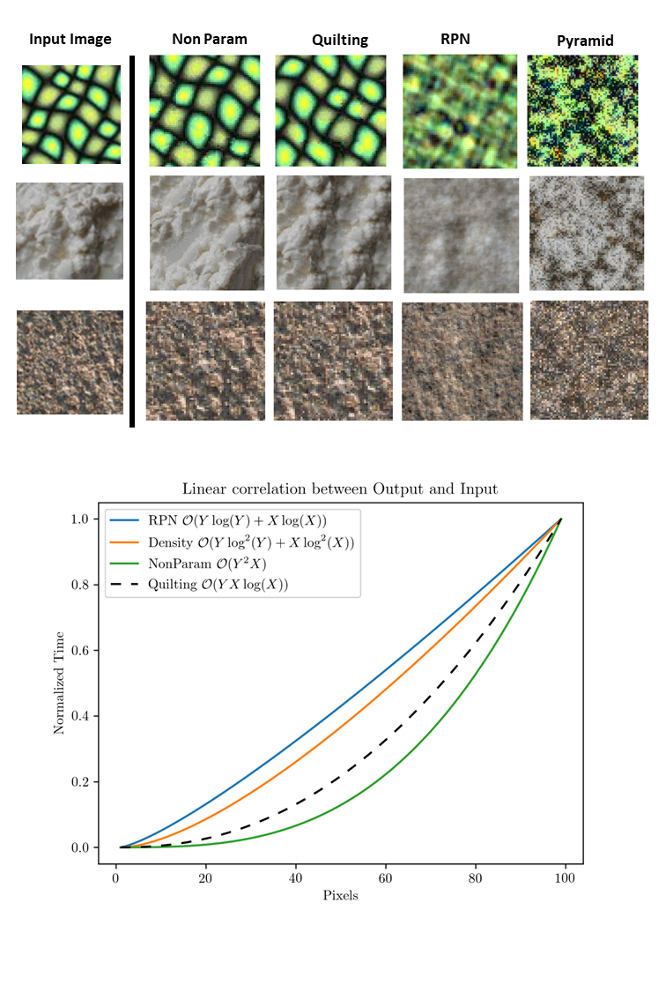

# TextureSynthesis

This repository contains numpy implementations of 4 texture synthesis algorithms. They both have a color and a grayscale implementation.
the algorithms are: 
-Non-Parametric texture synthesis (1999) A.A Effros https://ieeexplore.ieee.org/document/790383  
-Pyramid-Based Texture Analysis/Synthesis (1995) D.J Heeger http://www.cns.nyu.edu/heegerlab/content/publications/Heeger-siggraph95.pdf 
-Image Quilting (2001) A.A Effros https://www2.eecs.berkeley.edu/Research/Projects/CS/vision/papers/efros-siggraph01.pdf  
-Random Phase Noise (2011) B. Galerne https://perso.telecom-paristech.fr/gousseau/random_phase.pdf  

Codes are avialable in Grayscale and color.  
For each a type, there is a script containing all the implementations but with no comments. The comments are only available for each individual implementation.  
For additional information and general intuition of the synthesis works, please refer to the powerpoint file.  
A performance analysis of the diffenrent algorithm is also done (notebook/xls/powerpoint files) to balance out quality of results and computaion time (Non-parametric texture synthesis is really slow ZZZzzz)

